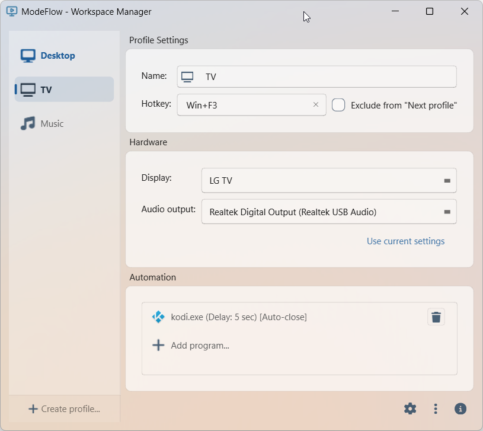
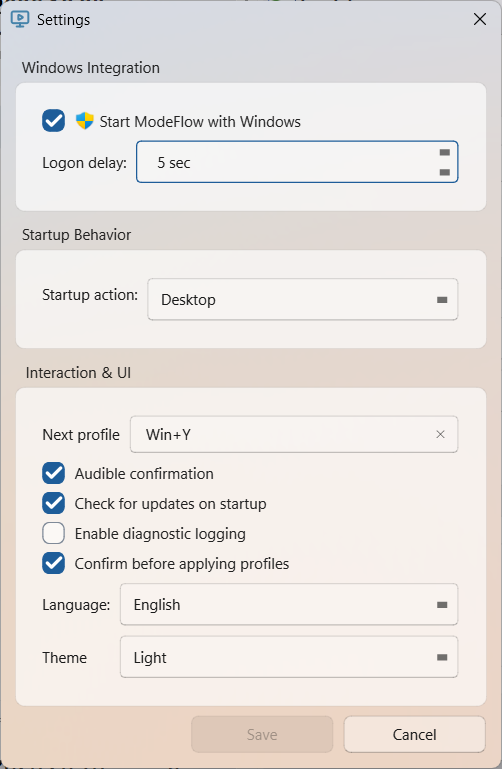
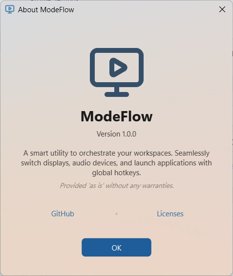
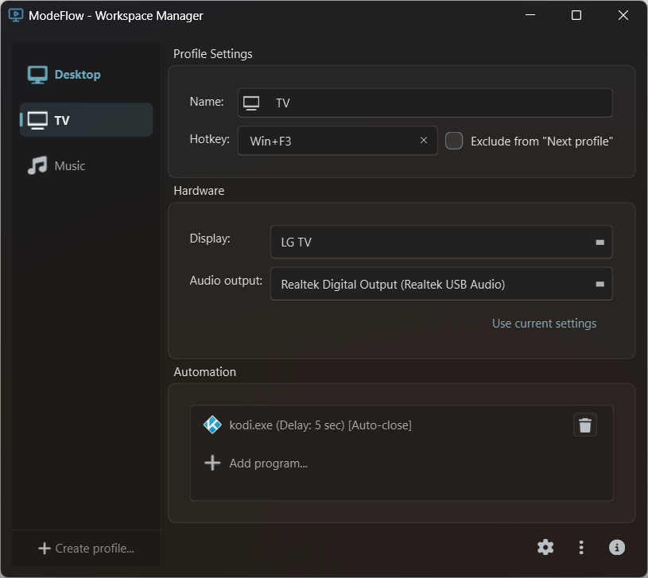
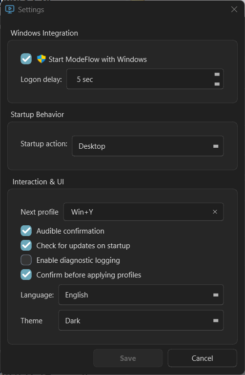
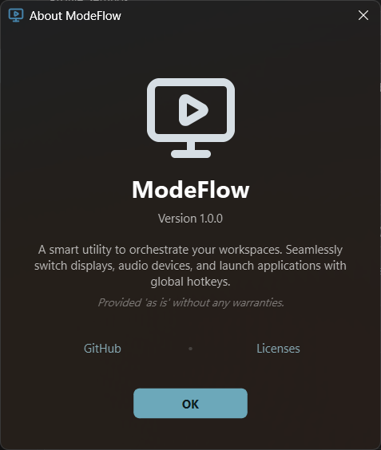

# ModeFlow - Workspace Manager


**ModeFlow** is a high-performance Windows utility designed for users who need to switch between different work, gaming, or media environments instantly. Reconfigure your entire workspace—monitors, audio, and apps—with a single global hotkey.

---

## 💻 System Requirements

- **Operating System**: Windows 10 (version 1809 or later) or Windows 11.
- **Hardware**: Compatible with all multi-monitor setups and digital audio interfaces.
- _Note: Windows 7, 8, and 8.1 are not supported due to modern High-DPI and Display API dependencies._

---

## ✨ Key Features

- **Portable App**: No installation required. Extract the ZIP and run `ModeFlow.exe`.
- **Display Profiles**: Switch between monitor setups such as Desktop, TV, or external screen layouts.
- **Audio Output Switching**: Change the default audio output device as part of a profile.
- **App Launching**: Start a selected application with an optional delay after applying a profile, with automatic cancellation protection.
- **Global Hotkeys**: Use system-wide shortcuts to apply a specific profile or cycle through profiles.
- **Logon Startup**: Apply your preferred profile automatically when you sign in to Windows.
- **Startup Delay**: Add a configurable delay at logon to give display and audio drivers time to initialize.
- **Sound Confirmation**: Optionally play a system sound after applying a profile.
- **Fluent Design & Mica**: Native Windows 11 Mica glass backdrops, rounded corners, and beautiful card layouts that automatically adapt to light/dark themes.
- **Self-Themed Dialogs**: Fully custom-themed, non-blocking file explorer dialogs that perfectly match your active theme.

---

## 📸 Screenshots

### Light Theme

|                  Main Window                  |                    Settings Dialog                    |                  About Dialog                  |
| :-------------------------------------------: | :---------------------------------------------------: | :--------------------------------------------: |
|  |  |  |

### Dark Theme

|                  Main Window                  |                    Settings Dialog                    |                  About Dialog                  |
| :-------------------------------------------: | :---------------------------------------------------: | :--------------------------------------------: |
|  |  |  |

---

## 🚀 Download

1. Go to the **[Releases](https://github.com/goloveshko/ModeFlow/releases)** page.
2. Download the latest `ModeFlow_v*.zip` file.
3. Extract the ZIP to any folder.
4. Run `ModeFlow.exe`.

---

## 🛠 Building from Source

### Prerequisites

- **Visual Studio 2022** (MSVC v143)
- **CMake 3.20+**
- **Ninja** (Recommended build tool)

### Compilation

To generate the static, self-contained binary:

```bash
scripts/build_release.bat
```

The output will be generated in `build/bin/Release/ModeFlow.exe`.

---

## 💡 Pro-Tips

### Startup Debugging

If ModeFlow fails to apply a profile during Windows logon (e.g., due to slow driver initialization):

1. Open **Settings**.
2. **Hold `Ctrl`** while enabling "Start ModeFlow with Windows".
3. This registers the task with the `--log` flag. A `log.txt` will be created in the application directory to help diagnose timing issues.

### Logon Delay

Use the **Logon Delay** setting in the Settings dialog to wait for 5–10 seconds after login. This provides a smoother transition on systems where the graphics driver loads slowly.

---

## 📜 License & Compliance

ModeFlow is released under the **MIT License**.

Third-party licenses and asset notices are listed in
[THIRD_PARTY_NOTICES.md](./THIRD_PARTY_NOTICES.md).

### Qt Framework

This application is **statically linked** with the Qt Framework under the terms of the **LGPLv3**.

- In compliance with the LGPLv3, the full source code for this application is provided in this repository.
- This allows users to modify the source code and re-link the application against different versions of the Qt library, fulfilling the "user's right to re-link" requirement for static builds.

---

## ☕ Support & Feedback

Developed with ❤️ by a professional C++ & Qt developer.

- **Telegram Support Bot**: [@itz2bot](https://t.me/itz2bot?start=github_readme)
- **Portfolio**: [sergey.is-a.dev](https://sergey.is-a.dev)
- **GitHub Issues**: [Report a bug](https://github.com/goloveshko/ModeFlow/issues)
